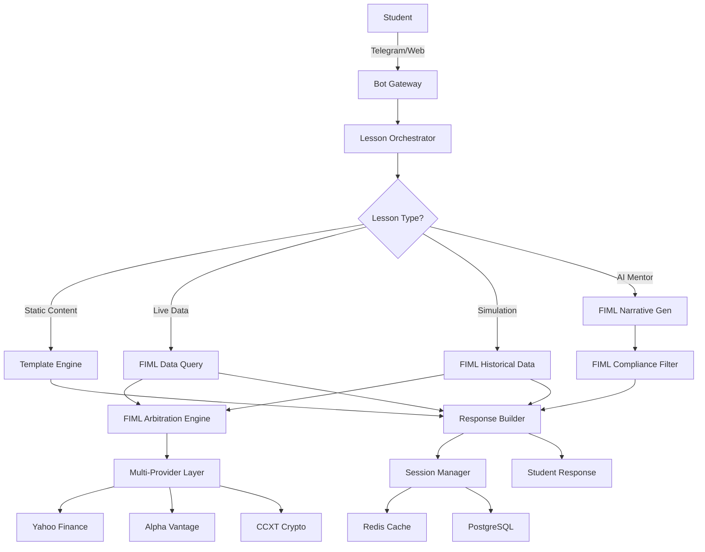

# Trading Education Platform - FIML-Powered Bot

**"Learn trading through real data, AI mentors, and live simulations — powered by FIML"**

!!! info "Platform Vision"
    A chat-native, adaptive trading education platform that teaches market fundamentals, chart literacy, psychology, and risk management through interactive lessons, live market simulations, and AI mentors—all powered by FIML's intelligent financial data infrastructure.

---

## Executive Summary

### What We're Building

An educational platform that combines:

- **Real Market Data** via FIML's multi-provider arbitration
- **AI-Native Mentorship** using FIML's MCP protocol integration
- **Live Simulations** powered by FIML's WebSocket streaming
- **Adaptive Learning** through FIML's session management
- **Safe Learning Environment** enforced by FIML's compliance framework

### Positioning

> "Learn trading through stories, simulations, and conversations—backed by real market data. No signals. No advice. Skills only."

### Target Users

| Persona | Description | Willingness to Pay |
|---------|-------------|-------------------|
| **Crypto-Curious Beginner** | Wants clarity, simple explanations | $10-$20/month |
| **Beginner Retail Trader** | Wants to avoid mistakes, gain confidence | $5-$15/month |
| **Intermediate Trader** | Risk management + TA drills | $15-$30/month |
| **Options Beginner** | Structured learning path | $20-$50/month |
| **Quant-Curious** | Deeper analytical modules | $30-$75/month |

---

## How FIML Powers the Platform

### 1. Real-Time Market Data Foundation

**FIML Integration Points:**

```python
# Educational lesson backed by real market data
from fiml.mcp import search_by_symbol
from fiml.agents import deep_equity_analysis

async def lesson_with_live_data(symbol: str):
    """Teach concepts using current market conditions"""
    
    # Get real-time snapshot via FIML
    data = await search_by_symbol(
        symbol=symbol,
        market="US",
        depth="standard"
    )
    
    # Generate educational narrative
    analysis = await deep_equity_analysis(
        symbol=symbol,
        include_narrative=True,
        include_recommendation=False  # Educational only
    )
    
    return {
        "current_price": data.price,
        "educational_context": analysis.narrative,
        "volatility_lesson": generate_volatility_lesson(data),
        "real_market_example": True
    }
```

**Benefits:**

- Students learn with **actual market conditions**, not stale data
- FIML's arbitration ensures **99.9% uptime** via automatic fallback
- Multi-provider support guarantees **diverse asset coverage**

### 2. Historical Simulation Engine

**FIML-Powered Simulations:**

```python
from fiml.core.cache import TimeSeriesCache
from fiml.providers import get_historical_data

async def create_flash_crash_simulation():
    """Historical event replay for educational purposes"""
    
    # Fetch real historical data via FIML
    crash_data = await get_historical_data(
        symbol="SPY",
        start_date="2010-05-06",
        end_date="2010-05-07",
        interval="1m"
    )
    
    return {
        "event": "Flash Crash 2010",
        "real_data": True,
        "data_source": "FIML Multi-Provider",
        "educational_objectives": [
            "Understand circuit breakers",
            "Recognize liquidity crises",
            "Practice emotional discipline"
        ],
        "simulation_data": crash_data
    }
```

**Available Simulations:**

| Simulation | Asset | Event | Educational Focus |
|------------|-------|-------|-------------------|
| **Flash Crash** | SPY | May 6, 2010 | Liquidity, circuit breakers |
| **BTC Halving** | BTC | 2020 Halving | Supply dynamics, volatility |
| **GameStop Short Squeeze** | GME | Jan 2021 | Short interest, momentum |
| **NVDA Earnings** | NVDA | Q3 2023 | Earnings reactions, IV crush |
| **COVID Crash** | SPY | March 2020 | Black swan, risk management |

### 3. AI Mentor System via MCP

**FIML's MCP Integration:**

```python
from fiml.mcp import MCPServer
from fiml.agents.narrative import NarrativeGenerator

class EducationalMentor:
    """AI mentor powered by FIML's narrative engine"""
    
    def __init__(self, persona: str):
        self.persona = persona  # Maya, Theo, or Zara
        self.narrative_gen = NarrativeGenerator()
        self.compliance_filter = ComplianceFilter()
        
    async def respond_to_question(self, question: str, context: dict):
        """Generate educational response with market context"""
        
        # Get relevant market data via FIML
        market_context = await self.get_market_context(context)
        
        # Generate narrative with compliance filtering
        response = await self.narrative_gen.generate(
            prompt=self.build_educational_prompt(question),
            market_data=market_context,
            persona=self.persona
        )
        
        # Apply safety filter
        safe_response = self.compliance_filter.apply(response)
        
        # Add mandatory disclaimer
        return f"{safe_response}\n\n⚠️ Educational purposes only — not investment advice."
```

**Mentor Personas:**

=== "Maya - The Guide"
    **Character:**
    
    - Calm, explanatory, patient
    - Uses real market examples via FIML
    - Focuses on fundamentals
    
    **Example Interaction:**
    ```
    Student: "Why is AAPL moving so much today?"
    
    Maya: "Great observation! Let me show you what's happening:
    
    [Real-time FIML data: AAPL +3.2%, volume 2.3x average]
    
    AAPL is experiencing higher-than-normal volatility today. This often 
    happens around earnings announcements or major product launches. 
    Notice how the volume is 2.3x the average? That tells us there's 
    significant market interest.
    
    Let's explore what moves stock prices in Lesson 3.2: 'Catalysts and 
    Volume Analysis.'
    
    ⚠️ Educational purposes only — not investment advice."
    ```

=== "Theo - The Analyst"
    **Character:**
    
    - Data-oriented, analytical
    - Leverages FIML's technical indicators
    - Risk-averse perspective
    
    **Example Interaction:**
    ```
    Student: "What do these lines on the chart mean?"
    
    Theo: "Excellent question. Let's analyze the technical setup:
    
    [FIML Technical Analysis: RSI=67, MACD positive crossover]
    
    You're looking at moving averages. The 50-day (blue) and 200-day (red) 
    averages help identify trends. When the faster 50-day crosses above the 
    slower 200-day, traders call this a 'golden cross'—often interpreted 
    as bullish.
    
    But remember: no indicator is 100% accurate. That's why we also look 
    at volume, fundamentals, and overall market conditions.
    
    Ready for Lesson 5.1: 'Moving Averages Deep Dive'?
    
    ⚠️ Educational purposes only — not investment advice."
    ```

=== "Zara - The Psychologist"
    **Character:**
    
    - Psychology and discipline focused
    - Uses FIML data to demonstrate behavioral patterns
    - Emphasizes risk mindset
    
    **Example Interaction:**
    ```
    Student: "I keep selling too early when stocks go up!"
    
    Zara: "You're experiencing a very common psychological pattern called 
    'premature profit-taking.' Let me show you something:
    
    [FIML Historical Data: Average retracement analysis]
    
    Our data shows that profitable positions often experience 2-3 
    pullbacks before continuing their trend. Your instinct to 'lock in 
    gains' is natural—our brains are wired to avoid regret.
    
    The key is having a plan BEFORE you enter. Let's work through 
    Lesson 7.3: 'Setting Price Targets and Managing Emotions.'
    
    ⚠️ Educational purposes only — not investment advice."
    ```

### 4. WebSocket Live Learning Feed

**Real-Time Education:**

```python
from fiml.websocket import WebSocketStreamer

async def live_learning_session(symbols: list[str]):
    """Stream real market data for live lessons"""
    
    uri = "ws://fiml-server:8000/ws/prices/" + ",".join(symbols)
    
    async with websockets.connect(uri) as ws:
        print("🎓 Live Learning Session Started")
        
        while True:
            update = await ws.recv()
            data = json.loads(update)
            
            # Educational commentary on real price moves
            if abs(data['change_percent']) > 1.0:
                await send_educational_alert(
                    symbol=data['symbol'],
                    change=data['change_percent'],
                    lesson_context="volatility_basics"
                )
```

**Use Cases:**

- **Practice Mode**: Students watch real markets and practice analysis
- **Simulation Validation**: Compare student predictions to actual movements
- **Event-Driven Learning**: Automatic lessons when major market events occur
- **Portfolio Tracking**: Educational portfolios with real price updates

### 5. Adaptive Learning via Session Management

**FIML Session Integration:**

```python
from fiml.features.session import SessionManager

class AdaptiveLearningEngine:
    """Track student progress using FIML's session system"""
    
    def __init__(self):
        self.session_mgr = SessionManager()
        
    async def track_lesson_completion(self, user_id: str, lesson_id: str):
        """Store progress and adapt difficulty"""
        
        session = await self.session_mgr.get_or_create(user_id)
        
        # Update mastery score
        session.data['mastery'][lesson_id] = self.calculate_mastery(
            recent_success=session.data['quiz_scores'][-5:],
            previous_mastery=session.data['mastery'].get(lesson_id, 0.5)
        )
        
        # Determine next lesson based on mastery
        next_lesson = self.select_next_lesson(
            mastery_score=session.data['mastery'][lesson_id],
            completed_lessons=session.data['completed'],
            error_patterns=session.data['errors']
        )
        
        await self.session_mgr.update(user_id, session.data)
        
        return next_lesson
```

**Adaptive Logic:**

```python
def select_next_lesson(mastery: float, completed: set, errors: list):
    """FIML-powered adaptive path selection"""
    
    if mastery < 0.6:
        # Review mode - reinforce concepts
        return get_review_lesson(errors[-3:])
    
    elif 0.6 <= mastery < 0.8:
        # New content - appropriate difficulty
        return get_progressive_lesson(completed)
    
    else:
        # Mastery achieved - unlock advanced content
        return get_scenario_unlock(completed)
```

### 6. Compliance & Safety Framework

**FIML Compliance Integration:**

```python
from fiml.features.compliance import ComplianceFramework

class EducationalComplianceLayer:
    """Ensure all content meets regulatory standards"""
    
    def __init__(self):
        self.compliance = ComplianceFramework()
        
    async def validate_educational_content(self, content: dict):
        """Screen content for compliance violations"""
        
        # Check for prohibited language
        violations = self.compliance.check_response(
            content['text'],
            user_region=content['user_region']
        )
        
        if violations:
            # Replace with safe educational content
            return self.generate_safe_alternative(content, violations)
        
        # Add region-appropriate disclaimer
        disclaimer = self.compliance.get_disclaimer(content['user_region'])
        content['text'] += f"\n\n{disclaimer}"
        
        return content
```

**Safety Rules:**

!!! danger "Hard Compliance Rules"
    - ❌ No "buy/sell" recommendations
    - ❌ No specific asset opinions ("AAPL will rise")
    - ❌ No portfolio evaluation
    - ❌ No leverage encouragement
    - ❌ No expected returns promises
    - ❌ No personalized investment actions

!!! success "Safe Educational Patterns"
    - ✅ "Here's how moving averages work..."
    - ✅ "In this historical example, we observe..."
    - ✅ "Risk management principles suggest..."
    - ✅ "This concept is illustrated by..."
    - ✅ "Let's analyze what happened in this scenario..."

---

## Platform Architecture

### System Flow



### Technology Stack

=== "Core Platform"
    - **Bot Framework**: Python Telegram Bot / FastAPI Web
    - **Orchestration**: Node.js gateway + Python microservices
    - **Data Intelligence**: **FIML MCP Server**
    - **AI/LLM**: Azure OpenAI (via FIML narrative engine)
    - **Session State**: Redis (via FIML session manager)
    - **Persistence**: PostgreSQL (shared with FIML)

=== "FIML Integration Layer"
    - **MCP Protocol**: Direct integration for AI mentors
    - **Data Arbitration**: Multi-provider financial data
    - **WebSocket Streaming**: Real-time market feeds
    - **Compliance Framework**: Regional safety filters
    - **Session Management**: Multi-query context tracking
    - **Narrative Generation**: Azure OpenAI educational content

=== "Infrastructure"
    - **Containers**: Docker multi-service compose
    - **Orchestration**: Kubernetes (production)
    - **Monitoring**: Prometheus + Grafana (FIML metrics)
    - **CDN**: S3-compatible for chart images
    - **Deployment**: GitHub Actions CI/CD

---

## Educational Content Structure

### Skill Tree Architecture

```
Phase 1 (MVP) - 20 Lessons
├── Foundations (10 lessons)
│   ├── What is a Stock?
│   ├── Reading Price Charts
│   ├── Volume Basics
│   ├── Market Orders
│   └── ... (6 more)
│
├── Crypto Intro (10 lessons)
│   ├── Blockchain Basics
│   ├── Bitcoin vs Altcoins
│   ├── Exchange Types
│   ├── Wallet Safety
│   └── ... (6 more)
│
└── Simulations (5 scenarios)
    ├── Flash Crash 2010 (SPY)
    ├── BTC Halving 2020
    ├── GameStop Squeeze 2021
    ├── NVDA Earnings Jump
    └── COVID-19 Crash

Phase 2 (Post-MVP)
├── Technical Analysis (15 lessons)
├── Risk Management (12 lessons)
├── Trading Psychology (10 lessons)
├── Options Trading (20 lessons)
├── Macro Economics (15 lessons)
└── Quantitative Methods (18 lessons)
```

### Lesson Template (FIML-Enhanced)

```yaml
lesson:
  id: "foundations_001"
  title: "Understanding Stock Prices"
  duration_minutes: 3
  
  learning_objectives:
    - "Understand bid-ask spread"
    - "Identify price movements"
    - "Read basic charts"
  
  content:
    introduction: |
      Every second, millions of trades happen in markets worldwide. 
      Let's see what's happening right now with a real stock:
    
    live_example:
      type: "fiml_query"
      source: "search-by-symbol"
      params:
        symbol: "AAPL"
        market: "US"
      display_fields:
        - current_price
        - change_percent
        - volume
        - bid_ask_spread
    
    explanation: |
      Notice the 'Bid' and 'Ask' prices? The bid is what buyers are 
      willing to pay, the ask is what sellers want. The difference 
      is called the spread—it's the market's "transaction cost."
      
      [FIML provides real-time data so you always learn with current examples]
    
    chart:
      type: "fiml_historical"
      symbol: "AAPL"
      period: "1d"
      interval: "5m"
      annotations:
        - type: "highlight"
          time: "current"
          label: "Current price"
  
  quiz:
    question: "If the bid is $150.00 and ask is $150.05, what is the spread?"
    type: "multiple_choice"
    options:
      - text: "$0.05"
        correct: true
        feedback: "Correct! The spread is ask - bid = $150.05 - $150.00 = $0.05"
      - text: "$150.00"
        correct: false
        feedback: "That's the bid price, not the spread. Try again!"
      - text: "$300.05"
        correct: false
        feedback: "That's the sum, not the difference. The spread is ask - bid."
  
  rewards:
    xp: 10
    unlock_conditions:
      - "quiz_passed"
    next_lesson: "foundations_002"
  
  fiml_integration:
    data_refresh: "on_load"
    compliance_check: true
    disclaimer_required: true
```

### Branching Scenario Example

```python
async def bitcoin_volatility_scenario(user_id: str):
    """Educational scenario using live BTC data"""
    
    # Fetch real BTC price via FIML
    btc_data = await search_by_coin(
        symbol="BTC",
        exchange="binance",
        pair="USDT"
    )
    
    scenario = {
        "title": "Bitcoin Weekend Volatility",
        "setup": f"""
            It's Friday evening. Bitcoin is trading at ${btc_data.price:,.2f}.
            You're monitoring the market when you notice increasing volatility.
            
            [Real current BTC data from FIML]
            
            What's your approach?
        """,
        
        "choices": [
            {
                "id": "watch_wait",
                "text": "Monitor the situation, take no action",
                "outcome": "cautious_observer",
                "teaches": "patience, avoiding FOMO"
            },
            {
                "id": "set_alerts",
                "text": "Set price alerts at ±5% levels",
                "outcome": "prepared_trader",
                "teaches": "risk management, automation"
            },
            {
                "id": "check_fundamentals",
                "text": "Research recent Bitcoin news and on-chain data",
                "outcome": "informed_decision",
                "teaches": "fundamental analysis, context"
            },
            {
                "id": "panic_response",
                "text": "Immediately react to price movements",
                "outcome": "emotional_trader",
                "teaches": "psychology, avoiding impulsive decisions"
            }
        ]
    }
    
    return scenario
```

---

## Gamification System

### XP & Progression

```python
class GamificationEngine:
    """Reward system integrated with FIML sessions"""
    
    XP_REWARDS = {
        "lesson_completed": 10,
        "quiz_perfect": 15,
        "simulation_completed": 25,
        "scenario_mastered": 30,
        "live_analysis_correct": 20,
        "streak_maintained": 5,
        "daily_quest": 50
    }
    
    async def award_xp(self, user_id: str, action: str, metadata: dict):
        """Award XP and update progression"""
        
        session = await session_manager.get(user_id)
        
        # Base XP
        xp = self.XP_REWARDS.get(action, 0)
        
        # Bonus multipliers
        if session.data['streak_days'] >= 7:
            xp *= 1.5  # Weekly streak bonus
        
        if metadata.get('difficulty') == 'advanced':
            xp *= 1.3  # Advanced content bonus
        
        # Update session
        session.data['total_xp'] += xp
        session.data['level'] = self.calculate_level(session.data['total_xp'])
        
        await session_manager.update(user_id, session.data)
        
        return {
            "xp_earned": xp,
            "total_xp": session.data['total_xp'],
            "new_level": session.data['level']
        }
```

### Progression System

| Level Range | Title | Unlocks |
|-------------|-------|---------|
| 1-5 | Novice Learner | Basic lessons, 3 simulations |
| 6-10 | Apprentice Trader | All foundation modules, 5 simulations |
| 11-20 | Skilled Analyst | Technical analysis, advanced scenarios |
| 21-30 | Expert Strategist | Options, macro, all content |
| 31-50 | Market Sage | Certification exams, prestige mode |

### Badges & Achievements

```yaml
badges:
  market_observer:
    name: "Market Observer"
    description: "Completed 10 live data analysis exercises"
    icon: "👁️"
    xp_bonus: 100
    
  flash_crash_survivor:
    name: "Flash Crash Survivor"
    description: "Successfully navigated the 2010 Flash Crash simulation"
    icon: "⚡"
    xp_bonus: 150
    
  streak_champion:
    name: "30-Day Streak"
    description: "Maintained learning streak for 30 consecutive days"
    icon: "🔥"
    xp_bonus: 500
    
  crypto_native:
    name: "Crypto Native"
    description: "Mastered all cryptocurrency modules"
    icon: "₿"
    xp_bonus: 200
```

---

## Monetization Strategy

### Tier Structure

=== "Free Tier"
    **Access:**
    
    - 20 foundation lessons
    - 3 historical simulations
    - Basic FIML data queries (cached)
    - 1 AI mentor interaction per day
    - Daily XP cap: 200
    
    **FIML Integration:**
    
    - Standard data refresh (15-minute delay)
    - L2 cache priority (slower, but reliable)
    - Limited WebSocket streaming

=== "Pro Tier ($9-$19/month)"
    **Access:**
    
    - All lessons and modules
    - Unlimited simulations
    - All 3 AI mentors (Maya, Theo, Zara)
    - Unlimited AI interactions
    - Certificate exams
    - Streak freeze (2x per month)
    - Priority support
    
    **FIML Integration:**
    
    - Real-time data (L1 cache priority)
    - Full WebSocket streaming access
    - Advanced FIML queries (correlations, technical analysis)
    - Historical data downloads

=== "Premium Tier ($29-$49/month)"
    **Access:**
    
    - Everything in Pro
    - Advanced modules (Options, Quant, Macro)
    - Weekly AI-powered portfolio reviews (educational only)
    - 1-on-1 mentor sessions (text-based)
    - Early access to new content
    - Custom learning paths
    
    **FIML Integration:**
    
    - Priority arbitration routing
    - Custom FIML workflows
    - Advanced agent orchestration
    - Unlimited historical data
    - Export capabilities

### FIML Cost Optimization

```python
class CostOptimizedDataAccess:
    """Minimize FIML API costs while maximizing learning value"""
    
    def __init__(self, user_tier: str):
        self.tier = user_tier
        
    async def get_educational_data(self, query: dict):
        """Tier-appropriate data access"""
        
        if self.tier == "free":
            # Use cached data, batch queries
            return await fiml.query(
                **query,
                cache_strategy="prefer_cache",
                max_age_minutes=15,
                providers=["yahoo_finance"]  # Free tier only
            )
        
        elif self.tier == "pro":
            # Real-time with cost controls
            return await fiml.query(
                **query,
                cache_strategy="fresh_when_available",
                max_age_minutes=1,
                providers=["yahoo_finance", "alpha_vantage"]
            )
        
        else:  # premium
            # Full FIML capabilities
            return await fiml.query(
                **query,
                cache_strategy="always_fresh",
                enable_arbitration=True,
                all_providers=True
            )
```

---

## Daily User Flow

### Morning Routine

```python
async def daily_learning_session(user_id: str):
    """FIML-powered daily quest"""
    
    session = await session_manager.get(user_id)
    
    # 1. Welcome with real market snapshot
    market_snapshot = await fiml.get_market_overview()
    
    greeting = f"""
    Good morning! 🌅
    
    Today's Market Snapshot (via FIML):
    • S&P 500: {market_snapshot['SPY']['change']:+.2f}%
    • Nasdaq: {market_snapshot['QQQ']['change']:+.2f}%
    • Bitcoin: ${market_snapshot['BTC']['price']:,.0f}
    
    Your Daily Quest:
    ✅ Complete 1 lesson (10 XP)
    ✅ Pass 1 quiz (15 XP)
    ✅ Practice with live data (20 XP)
    
    Current Streak: {session.data['streak_days']} days 🔥
    """
    
    # 2. Personalized lesson recommendation
    next_lesson = adaptive_engine.select_lesson(
        mastery_scores=session.data['mastery'],
        recent_errors=session.data['errors'][-5:],
        market_conditions=market_snapshot
    )
    
    # 3. Live practice opportunity
    if market_snapshot['volatility'] > 1.5:
        # High volatility - offer volatility lesson
        practice = generate_volatility_practice(market_snapshot)
    else:
        # Normal conditions - standard practice
        practice = generate_standard_practice(next_lesson)
    
    return {
        "greeting": greeting,
        "daily_lesson": next_lesson,
        "practice_mode": practice,
        "bonus_challenge": check_for_market_events(market_snapshot)
    }
```

### Practice Mode (FIML WebSocket)

```python
async def live_practice_mode(user_id: str, symbols: list[str]):
    """Real-time market observation practice"""
    
    uri = f"ws://fiml-server:8000/ws/prices/{','.join(symbols)}"
    
    instructions = """
    🎓 Live Practice Mode
    
    Watch these stocks for the next 5 minutes. Your task:
    1. Identify which stock has the highest volatility
    2. Note any significant volume spikes
    3. Describe the overall trend direction
    
    [Real-time data streaming from FIML...]
    """
    
    async with websockets.connect(uri) as ws:
        start_time = time.time()
        observations = []
        
        while time.time() - start_time < 300:  # 5 minutes
            update = await ws.recv()
            data = json.loads(update)
            
            # Store for analysis
            observations.append(data)
            
            # Real-time educational hints
            if abs(data['change_percent']) > 0.5:
                hint = f"💡 {data['symbol']} just moved {data['change_percent']:+.2f}% - note this!"
        
        # Quiz after observation
        return generate_practice_quiz(observations)
```

---

## Safety & Compliance

### FIML Compliance Layer Integration

```python
class EducationalComplianceSystem:
    """Multi-layer safety using FIML compliance framework"""
    
    def __init__(self):
        self.fiml_compliance = ComplianceFramework()
        self.educational_rules = self.load_education_rules()
    
    async def validate_content(self, content: str, user_region: str):
        """Comprehensive compliance check"""
        
        # Layer 1: FIML base compliance
        fiml_check = await self.fiml_compliance.check_response(
            content,
            user_region=user_region
        )
        
        if not fiml_check.is_compliant:
            return self.generate_safe_alternative(content, fiml_check)
        
        # Layer 2: Educational-specific rules
        edu_check = self.check_educational_compliance(content)
        
        if not edu_check.is_safe:
            return self.rewrite_for_education(content, edu_check)
        
        # Layer 3: Add disclaimers
        return self.add_educational_disclaimers(content, user_region)
    
    def check_educational_compliance(self, content: str) -> ComplianceResult:
        """Educational-specific safety checks"""
        
        violations = []
        
        # Prohibited patterns
        if re.search(r'\b(buy|sell|invest in) [A-Z]{1,5}\b', content, re.I):
            violations.append("specific_recommendation")
        
        if re.search(r'(will|should) (rise|fall|moon|crash)', content, re.I):
            violations.append("price_prediction")
        
        if re.search(r'(guaranteed|certain|sure thing)', content, re.I):
            violations.append("false_certainty")
        
        if re.search(r'(leverage|margin|borrow)', content, re.I):
            violations.append("risky_instruments")
        
        return ComplianceResult(
            is_safe=len(violations) == 0,
            violations=violations
        )
```

### Safe Response Templates

```python
SAFE_TEMPLATES = {
    "concept_explanation": """
        Here's the educational concept: {concept}
        
        Example: {example}
        
        Remember, this is for learning purposes. Always consult a financial 
        advisor before making investment decisions.
    """,
    
    "historical_context": """
        Historically, we observe that {observation}.
        
        In the case of {historical_example}, {what_happened}.
        
        This teaches us about {lesson}.
        
        ⚠️ Past performance doesn't guarantee future results.
    """,
    
    "scenario_outcome": """
        In this scenario, {action} led to {outcome}.
        
        The key lesson: {principle}
        
        In real trading, outcomes vary. This is educational only.
    """,
    
    "deflection": """
        I can't provide investment advice, but I can explain the concept:
        
        {educational_explanation}
        
        Would you like to learn more about {related_lesson}?
    """
}
```

### Escalation Triggers

```python
async def handle_unsafe_query(user_id: str, query: str):
    """Detect and handle concerning user queries"""
    
    escalation_triggers = {
        "financial_distress": [
            "need money now",
            "pay rent",
            "in debt",
            "desperate"
        ],
        "leverage_questions": [
            "max leverage",
            "margin call",
            "borrow to trade"
        ],
        "specific_advice": [
            "what should I buy",
            "sell my",
            "which stock"
        ]
    }
    
    for trigger_type, patterns in escalation_triggers.items():
        if any(pattern in query.lower() for pattern in patterns):
            
            # Log for review
            await log_escalation(user_id, trigger_type, query)
            
            # Provide safe educational response
            return SAFE_RESPONSES[trigger_type]
    
    # Normal educational flow
    return await process_educational_query(query)
```

---

## Analytics & Optimization

### Key Metrics (FIML-Enhanced)

```python
class PlatformAnalytics:
    """Track learning effectiveness and FIML usage"""
    
    async def track_session(self, user_id: str, session_data: dict):
        """Comprehensive session analytics"""
        
        metrics = {
            # Learning metrics
            "lessons_completed": len(session_data['completed']),
            "quiz_accuracy": calculate_accuracy(session_data['quiz_scores']),
            "time_per_lesson": session_data['avg_time'],
            "streak_days": session_data['streak_days'],
            
            # Engagement metrics
            "practice_mode_uses": session_data['practice_count'],
            "simulation_completions": session_data['simulations'],
            "mentor_interactions": session_data['ai_queries'],
            
            # FIML usage metrics
            "fiml_queries": session_data['fiml_queries'],
            "live_data_views": session_data['live_views'],
            "websocket_sessions": session_data['ws_sessions'],
            "data_freshness_avg": session_data['data_age_avg'],
            
            # Cost metrics
            "fiml_cache_hit_rate": session_data['cache_hits'] / session_data['total_queries'],
            "llm_token_usage": session_data['tokens_used'],
            "estimated_cost": self.calculate_cost(session_data)
        }
        
        return metrics
```

### Cost Control

```python
class CostOptimizer:
    """Minimize infrastructure costs while maximizing learning"""
    
    def __init__(self):
        self.fiml_cache_strategy = CacheStrategy()
        
    async def optimize_data_access(self, lesson_type: str, user_tier: str):
        """Smart data fetching based on context"""
        
        if lesson_type == "static_concept":
            # No need for real-time data
            return {
                "use_cached": True,
                "max_age_hours": 24,
                "provider": "mock"  # Use mock data for static lessons
            }
        
        elif lesson_type == "live_practice":
            # Real-time required
            return {
                "use_websocket": user_tier in ["pro", "premium"],
                "use_polling": user_tier == "free",
                "refresh_rate": 5000 if user_tier == "free" else 1000
            }
        
        elif lesson_type == "historical_simulation":
            # Historical data - cache aggressively
            return {
                "cache_key": f"sim_{lesson_type}_{lesson_id}",
                "ttl_days": 365,  # Historical data never changes
                "generate_once": True
            }
```

### A/B Testing Framework

```python
class ExperimentFramework:
    """Test educational approaches"""
    
    experiments = {
        "mentor_style": {
            "variants": ["formal", "casual", "technical"],
            "metric": "completion_rate",
            "duration_days": 14
        },
        
        "data_refresh_rate": {
            "variants": ["1min", "5min", "15min"],
            "metric": "engagement_score",
            "duration_days": 7
        },
        
        "gamification_intensity": {
            "variants": ["high", "medium", "low"],
            "metric": "retention_d7",
            "duration_days": 30
        }
    }
```

---

## Implementation Roadmap

### Phase 1: MVP (Months 1-2)

**Weeks 1-2: FIML Integration Foundation**

- [ ] Set up FIML server instance
- [ ] Configure multi-provider access (Yahoo, Alpha Vantage)
- [ ] Implement FIML MCP client
- [ ] Test data arbitration for educational use cases
- [ ] Set up session management integration

**Weeks 3-4: Core Educational Platform**

- [ ] Build Telegram bot gateway
- [ ] Implement lesson template engine
- [ ] Create 20 foundation lessons
- [ ] Integrate FIML live data into lessons
- [ ] Build quiz system

**Weeks 5-6: AI Mentors & Simulations**

- [ ] Deploy Maya persona (first mentor)
- [ ] Integrate FIML narrative generation
- [ ] Create 3 historical simulations (Flash Crash, BTC Halving, GME)
- [ ] Implement compliance filters
- [ ] Test end-to-end learning flow

**Weeks 7-8: Polish & Launch**

- [ ] Implement XP and streak system
- [ ] Add analytics tracking
- [ ] Beta testing with 50-100 users
- [ ] Performance optimization
- [ ] Public launch

### Phase 2: Growth (Months 3-6)

**Content Expansion:**

- [ ] Add Theo and Zara mentors
- [ ] Create 40 additional lessons (TA, Risk Management)
- [ ] Add 5 more historical simulations
- [ ] Build branching scenario engine
- [ ] Implement adaptive learning algorithm

**Technical Enhancement:**

- [ ] Full FIML WebSocket integration for practice mode
- [ ] Advanced FIML queries (correlations, technical indicators)
- [ ] Multi-language support (Spanish, Portuguese, Chinese)
- [ ] Mobile app (React Native)
- [ ] Payment processing (Stripe)

**Features:**

- [ ] Certificate exams
- [ ] Weekly leagues
- [ ] Referral system
- [ ] Advanced badges
- [ ] Portfolio practice mode (paper trading with FIML data)

### Phase 3: Scale (Months 7-12)

- [ ] Platform integrations (ChatGPT GPT, Claude Desktop)
- [ ] Advanced modules (Options, Quant, Macro)
- [ ] Community features
- [ ] Live webinars
- [ ] Partnership program
- [ ] Enterprise tier

---

## Success Metrics

### Learning Effectiveness

| Metric | Target | Measurement |
|--------|--------|-------------|
| **Lesson Completion** | >70% | Lessons completed / started |
| **Quiz Accuracy** | >65% | Correct answers / total |
| **7-Day Retention** | >40% | Users active after 7 days |
| **30-Day Retention** | >20% | Users active after 30 days |
| **Module Completion** | >50% | Full modules completed |

### Engagement

| Metric | Target | Measurement |
|--------|--------|-------------|
| **Daily Active Users** | Growing 10% MoM | Unique users per day |
| **Session Duration** | >12 minutes | Avg time per session |
| **Streak Maintenance** | >30% sustain 7+ days | Users with 7+ day streaks |
| **Practice Mode Usage** | >50% weekly | Users using live practice |
| **Mentor Interactions** | >3 per week | AI mentor queries |

### Business

| Metric | Target | Measurement |
|--------|--------|-------------|
| **Free → Pro Conversion** | >15% | Paid users / total users |
| **Churn Rate** | <10% monthly | Cancellations / subscribers |
| **LTV** | >$150 | Lifetime revenue per user |
| **CAC** | <$30 | Cost to acquire customer |
| **FIML Cost per MAU** | <$2 | FIML API costs / active users |

### Technical (FIML Integration)

| Metric | Target | Measurement |
|--------|--------|-------------|
| **Data Freshness** | <5 min average | Time since FIML update |
| **Cache Hit Rate** | >80% | Cached queries / total |
| **API Latency** | <500ms p95 | FIML query response time |
| **Uptime** | >99.5% | Platform availability |
| **WebSocket Stability** | >98% | Successful connections |

---

## Risk Mitigation

### Technical Risks

| Risk | Likelihood | Impact | Mitigation |
|------|------------|--------|------------|
| **FIML API downtime** | Medium | High | Multi-provider fallback, cached content |
| **LLM cost overrun** | High | Medium | Strict rate limits, template-first approach |
| **Scalability issues** | Medium | Medium | Redis caching, async architecture |
| **Data quality problems** | Low | Medium | FIML arbitration, data validation |

### Business Risks

| Risk | Likelihood | Impact | Mitigation |
|------|------------|--------|------------|
| **Low initial retention** | High | High | Daily quests, streak mechanics, push notifications |
| **Regulatory challenges** | Low | High | FIML compliance framework, legal review |
| **Content misinterpretation** | Medium | High | Constant disclaimers, safety filters |
| **Competition** | Medium | Medium | Unique FIML integration, superior data quality |

### Compliance Risks

| Risk | Likelihood | Impact | Mitigation |
|------|------------|--------|------------|
| **Platform policy violations** | Low | High | Strict no-advice policy, content screening |
| **Regional compliance** | Medium | Medium | FIML regional compliance, localized disclaimers |
| **User financial harm** | Low | Critical | Educational-only focus, escalation procedures |

---

## Conclusion

### Why This Will Work

**1. Real Data = Real Learning**

Traditional educational platforms use fake or stale data. We use **live market data via FIML**, making every lesson relevant and timely.

**2. AI-Native Design**

FIML's MCP integration allows seamless AI mentor experiences without building complex infrastructure ourselves.

**3. Proven Gamification**

Duolingo's model works. We're applying it to trading education with real-time market context.

**4. Cost-Effective Operations**

FIML's arbitration and caching dramatically reduce data costs compared to direct provider APIs.

**5. Compliance Built-In**

FIML's compliance framework ensures we stay on the right side of regulations globally.

### Unique Value Proposition

> "The only trading education platform where you learn with **real, live market data**, guided by **AI mentors**, practicing on **actual historical events**—all safely, compliantly, and affordably."

### Call to Action

Ready to build the future of trading education?

**Next Steps:**

1. Deploy FIML server (1 day)
2. Create first 10 lessons (1 week)
3. Launch beta with 50 users (2 weeks)
4. Iterate based on feedback (ongoing)

**Contact:**

- Technical questions: [FIML Documentation](https://kiarashplusplus.github.io/FIML/)
- Business inquiries: [GitHub Issues](https://github.com/kiarashplusplus/FIML/issues)
- Community: [Discord](https://discord.gg/fiml)

---

**⚠️ CRITICAL DISCLAIMER**: This platform provides financial education only. It does NOT provide investment advice, recommendations, or personalized guidance. All users must acknowledge they understand the educational nature of the content. Always consult licensed financial advisors before making investment decisions.

---

*Last Updated: November 23, 2025*  
*Document Version: 1.0*  
*FIML Version: 0.2.2*
